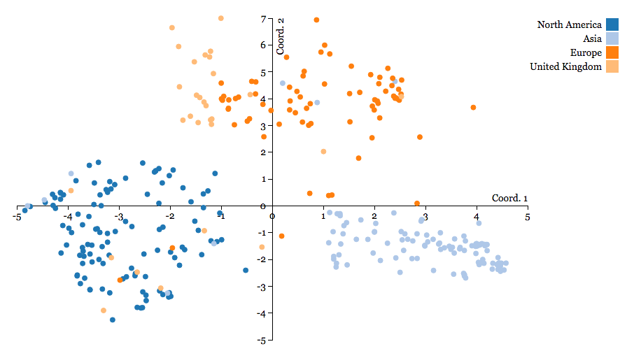
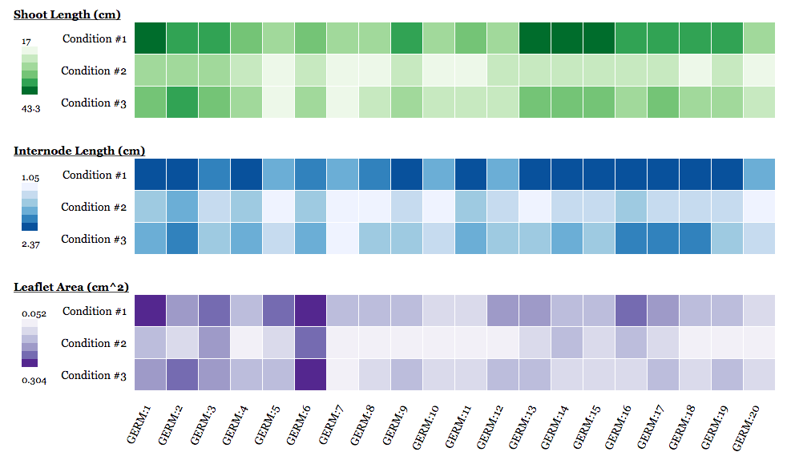
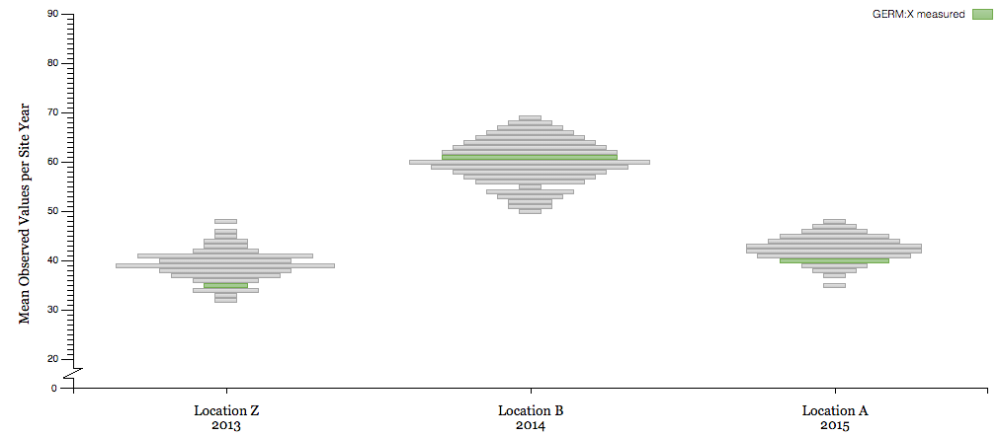

# User Charts
User-driven D3.js Charts that provide forms that allowing users to input data influencing D3.js charts.

## Charts Available:
- PCoA Chart: a D3.js scatterplot visualize Principal component analysis (PCoA) results. The user enters their PCoA results and an optional grouping of germplasm into the form. You can see this chart in action over at [bl.ocks.org]
(http://bl.ocks.org/laceysanderson/0173ae42017a47665e2e) and you can see the code behind the actual chart in [this gist](https://gist.github.com/laceysanderson/0173ae42017a47665e2e).

- Heatmap: a D3.js heatmap used to visualize differences in phenotype among multiple germplasm in a number of conditions and/or locations. The user enters a tab-delimited listing of the phenotype values for a given germplasm, trait and treatment/location combination.

- Bean Plot: a D3.js chart showing the distribution of phenotype values for a number of site years. The X-axis is each site-year, the y-axis is the phenotype values observed and the width of each bar represents the number of germplasm in a given site-year with the specified measurement. The user enters a tab-deminited listing of the phenotype values for each site-sear and germplasm combination as well as a label for the trait measured.

Further development in the form of additional charts and improved error/security checking is to come.
